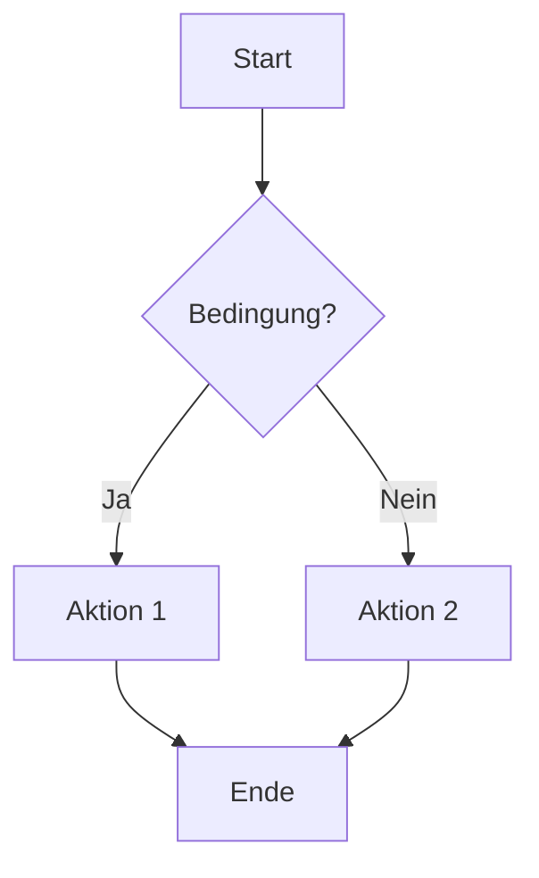
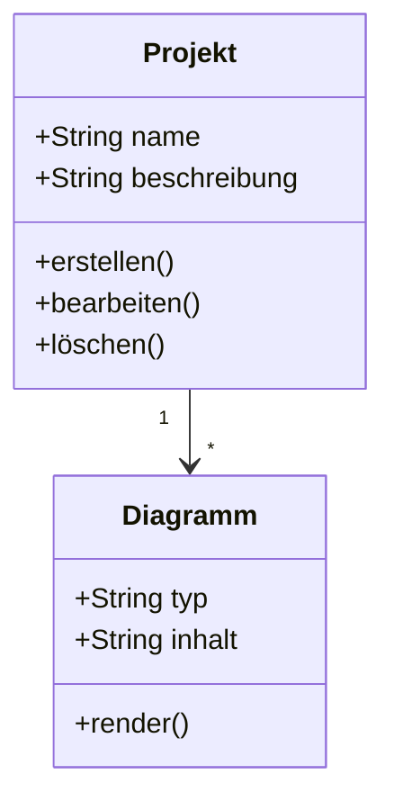

# Mermaiden

Ein Projekt für die Erstellung und Verwaltung von Mermaid-Diagrammen mit Code-Integration.

## Überblick

Mermaiden ist eine Sammlung von Mermaid-Diagrammen und zugehörigem Code, um komplexe Strukturen und Prozesse visuell darzustellen.

## Beispiel: Flowchart



## Beispiel: Klassendiagramm



## Installation

```bash
# Klonen Sie dieses Repository
git clone https://github.com/Hoinkkoma/mermaiden-.git
cd mermaiden-
```

## Verwendung

Die Mermaid-Diagramme können direkt in GitHub Markdown-Dateien angezeigt werden.

Für weitere Informationen siehe die [Mermaid-Dokumentation](https://mermaid.js.org/).

## Lizenz

Dieses Projekt ist unter der GPL-3.0 Lizenz lizenziert. Siehe [LICENSE](LICENSE) für Details.

## Autor

[Hoinkkoma](https://github.com/Hoinkkoma)