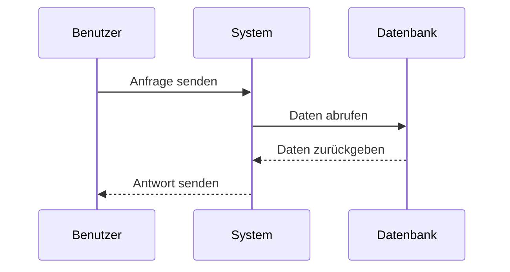
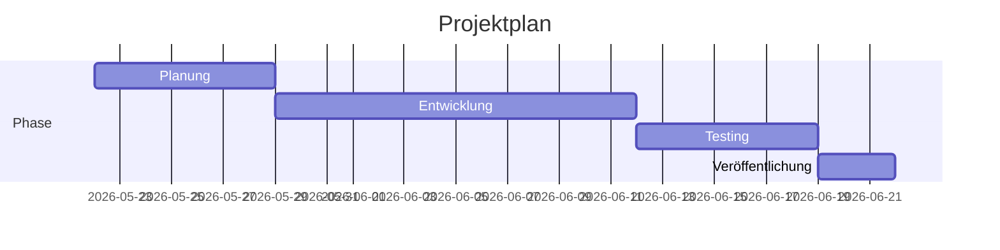
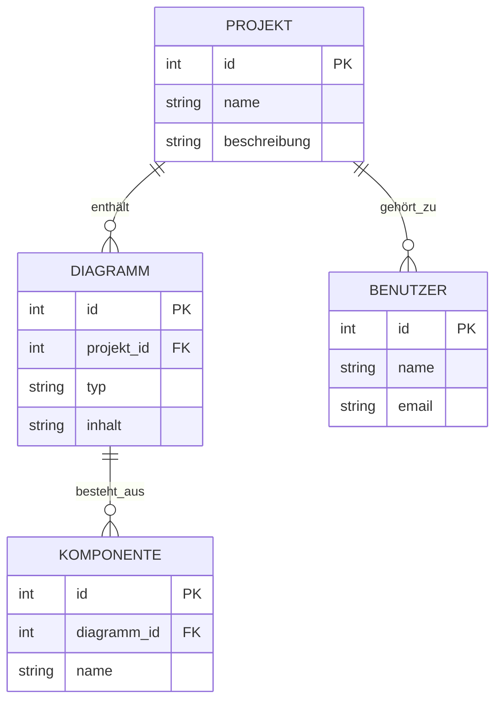
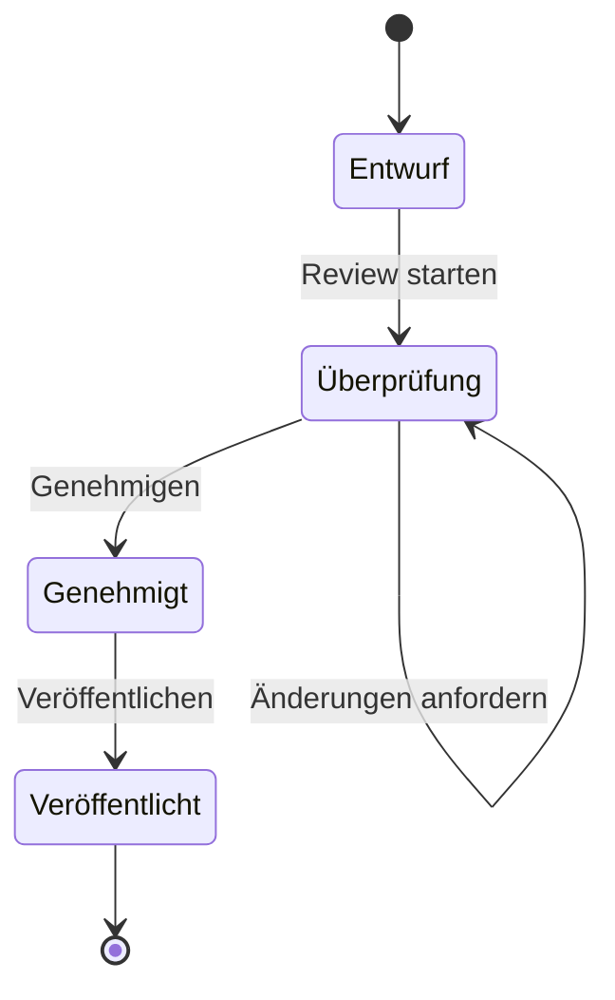
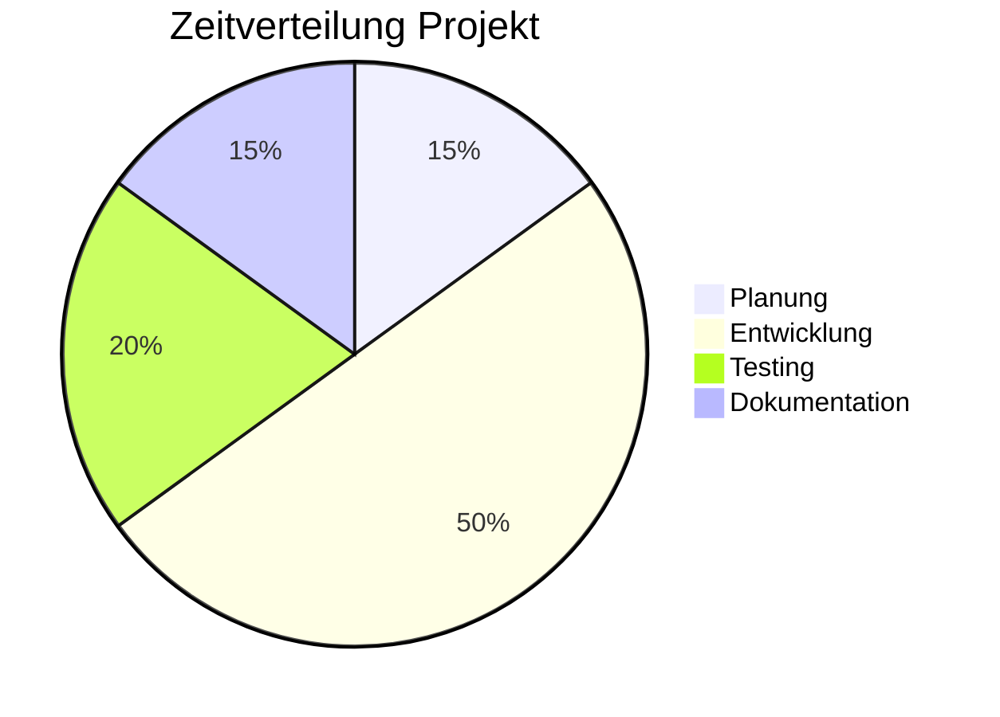
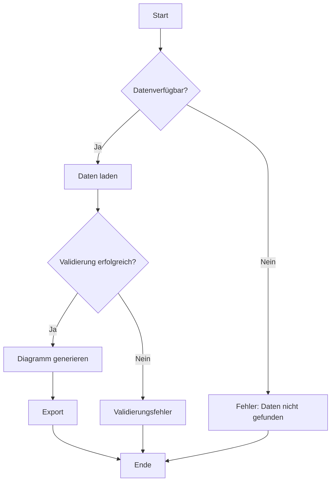
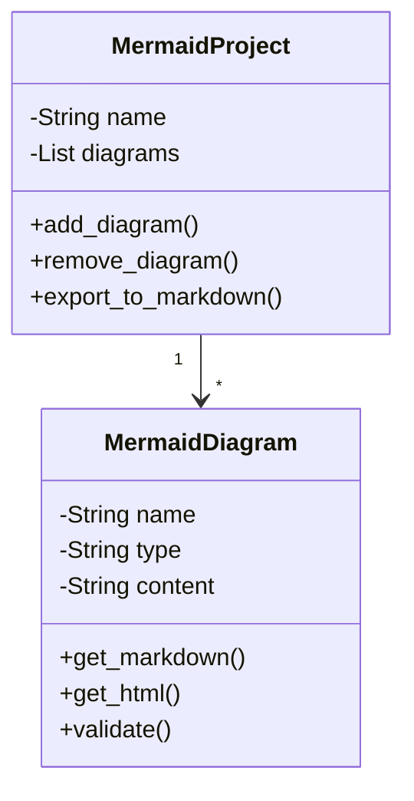

# Mermaid Diagramm Beispiele

## 1. Sequenzdiagramm

## 2. Gantt-Diagramm

## 3. Entity-Relationship Diagramm

## 4. State Diagramm

## 5. Pie Chart

## 6. Flowchart Komplexes Beispiel

## 7. Klassen-Diagramm

